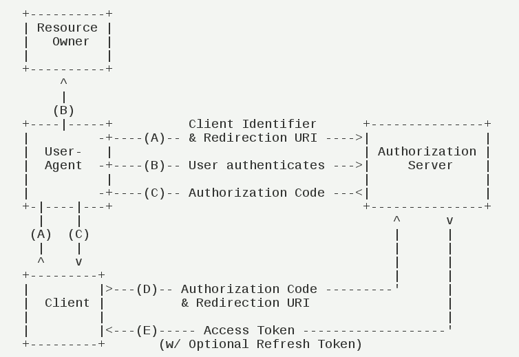

# spring-security5
spring security5. auth_server + auth_client + auth_resource

### 依赖redis。redis使用默认端口（6379）即可

1. 启动认证服务。spring-security-authentication-server
    > 端口：9001
2. 启动认证客户端，采用的是sso模式。spring-security-client-server
    > 端口：9002
3. 启动认证资源服务。spring-security-resouce-server
    > 端口：9003
4. 用postman或者curl命令调用接口增加一个client
   #### 4.1 增加一个管理员
   ```
   curl -H "Content-Type:application/json" -X POST --data '{ "name": "user_1", "password": "123456", "roles": ["admin"] }' http://localhost:9001/auth-server/user
   ```
   #### 4.2 增加一个auth client
   ```
   curl -H "Content-Type:application/json" -X POST --data '{ "client_id": "resourceServer1", "resource_ids": ["client100"], "client_secret": "123456", "scope": "select", "authorized_grant_types": ["authorization_code", "refresh_token"], "redirect_uri": ["http://localhost:9002/auth-client/login"], "authorities": ["admin"], "access_token_validity": 7200, "refresh_token_validity": 7200, "autoapprove": ["all"], "abc": 123 }' http://localhost:9001/auth-server/client 
   ```
   
5. 测试
   #####测试client中的受保护资源，并记录下来tokenValue的值
   http://localhost:9002/auth-client/user
   ```json
   {"authorities":[{"authority":"admin"}],"details":{"remoteAddress":"0:0:0:0:0:0:0:1","sessionId":null,"tokenValue":"67e457e1-ff98-4bd1-a535-47db5f145ad3","tokenType":"Bearer","decodedDetails":null},"authenticated":true,"userAuthentication":{"authorities":[{"authority":"admin"}],"details":null,"authenticated":true,"principal":"user_1","credentials":"N/A","name":"user_1"},"principal":"user_1","credentials":"","oauth2Request":{"clientId":"resourceServer1","scope":["select"],"requestParameters":{"client_id":"resourceServer1"},"resourceIds":["client100"],"authorities":[],"approved":true,"refresh":false,"redirectUri":null,"responseTypes":[],"extensions":{},"refreshTokenRequest":null,"grantType":null},"clientOnly":false,"name":"user_1"}
   ```
   
   #####测试resource中的受保护资源，xxx用上面的tokenValue代替
   http://localhost:9003/auth-resouce/protect/1?access_token=xxx
   



